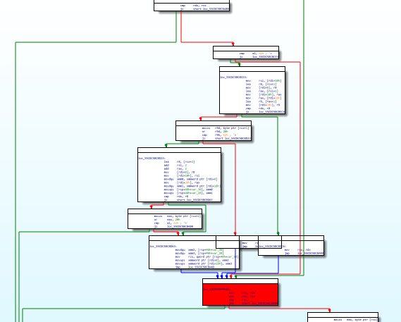

# ABNF: grammar is fun
The name of the challenge suggest that it might be a checker related to regular expression or DFAs

Run the file with no arguments, it return "No flag? Too much flag?" 

Run the program again with some abitrary input abcd, it throw a parse error.

Open the the program with IDA, get to the main function, with graph view mode.

First it do some quite a lot of initialization, then it comes with 2 important block, the red one and the green one. We run into the red one when argc = 1. We run into the green block when the checker accept the string.

There are two branches that can reach the green block. The RHS flow check the string with 'asia'. Otherwise it move into the orange block. Check again with the input 'asia', it indeed print Ok?. But it is not in the required format, so let's continue.

Then we jump into the function sub_55CDC5BCB960 inside block orange. The function is huge. So the first we need to find our desired destination.

We reach the red block for fail cases, and green block for accepted strings. The idea for this challenge is that we locate the 'important' block, the blocks that we must pass once on the way to the destination. These block can be seen as states in a automata. These block could be the first block in a loop, or a cut vertex in the graph. Then we try to navigate along the blocks to get to the destination.

From the code, we can see first it check the lowercase version of the string with **justcft{a**

Then we meet a loop that try to consume all remaining a's in the input string. At this point we are at the red block. Since the flag is the shortest string so only 1 a is required.

 

Then check for b's, the number of b should appears at most 2 times. So, to minimize the length of th flag no b is required. Then we reach the red block.
 

Then we can see that the next step is trying to navigate from the upper red block to the lower red block. This offer 3 choices, it must be either 'left', 'right' or 'something_else'.

Just repeat the whole process. Locate the destination block, find the way to reach it, consider the option and choose the shortest one.

The next step is to choose between 'long' and 'short'. Then a bait block that we could skip through. A number between 0-9, then 'simple' or 'hard' and a '-'. The flag so far is **justctf{aleft_long0_hard-**. Then it call another check function and check the last character with '}'

Again, we have another complex function. But using the same strategy to locate some of the important block. We realize that we can skip almost who function to to get the start of the xoxo checking. In fact it only require 'xoxoxoxoxoxoxoxo' is enough.

So the final flag is **justctf{aleft_long0_hard-xoxoxoxoxoxoxoxo}**
